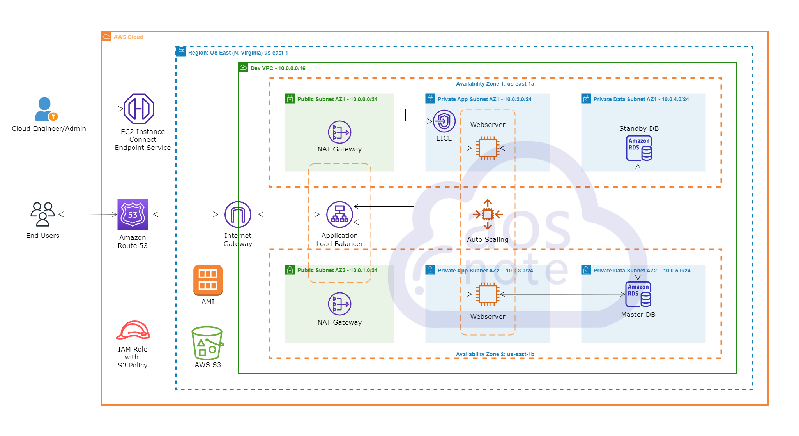

# Dynamic Web Application Deployment on AWS

This repository contains the scripts and resources used to deploy a dynamic web application on AWS using a multi-tier architecture. The architecture includes an Application Load Balancer, Auto Scaling Groups, and RDS for database management. Security best practices, including HTTPS enforcement and IAM roles, were implemented to ensure secure and scalable deployment.

## Architecture Overview

The architecture is designed to ensure high availability, fault tolerance, and scalability by using multiple Availability Zones, a load balancer, and auto-scaling groups.

## Scripts

### 1. **Software Installation and Server Requirements**
   - [Script for Software Installation and Server Requirements](https://github.com/simbaaws88/Host-a-Dynamic-Web-App-on-AWS-Cloud-with-an-EC2-Instance/blob/main/Script%20for%20Software%20Installation%20and%20Server%20Requirements.applescript)
   - This script installs the necessary software and configures the server to meet the application's requirements.

### 2. **Flyway Migration Script**
   - [[Flyway Migration Script](https://github.com/simbaaws88/Host-a-Dynamic-Web-App-on-AWS-Cloud-with-an-EC2-Instance/blob/main/Flyway%20Migrate%20Script.applescript)]
   - This script handles the database migration using Flyway to ensure the database is properly set up with the latest schema and data.

### 3. **AppServiceProvider Modification**
   - [AppServiceProvider.php](https://github.com/simbaaws88/Host-a-Dynamic-Web-App-on-AWS-Cloud-with-an-EC2-Instance/blob/main/AppServiceProvider.php)
   - The `AppServiceProvider.php` file has been modified to enforce HTTPS in a production environment using Laravel's `forceScheme` method.

## Usage

1. Clone this repository to your local machine.
   ```bash
   git clone https://github.com/yourusername/your-repository.git
   ```
   
2. Navigate to the directory and run the necessary scripts in your terminal.

3. Deploy the architecture using your preferred Infrastructure as Code (IaC) tool, like AWS CloudFormation or Terraform.

4. Ensure that all security groups, IAM roles, and other configurations are set up correctly as per the provided architecture diagram.

## Conclusion

This project demonstrates a robust and scalable approach to deploying a dynamic web application on AWS. By following the steps outlined in this repository, you can recreate the deployment in your environment.
